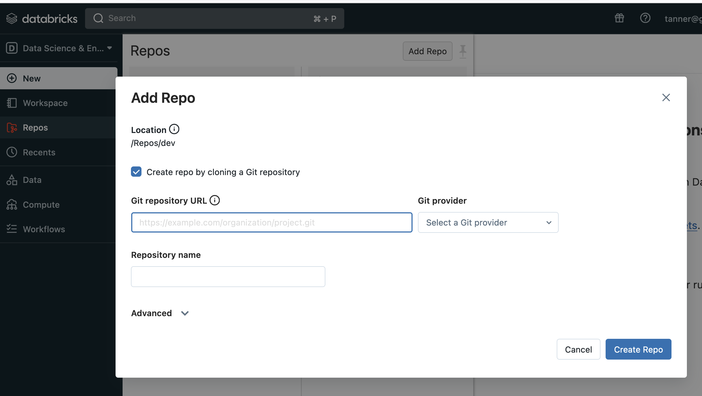
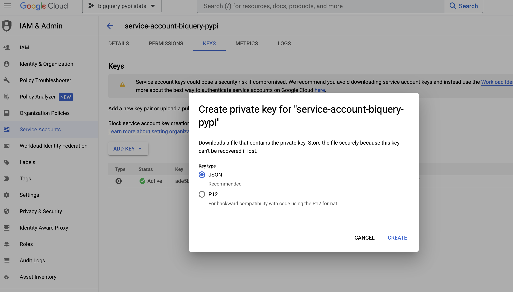
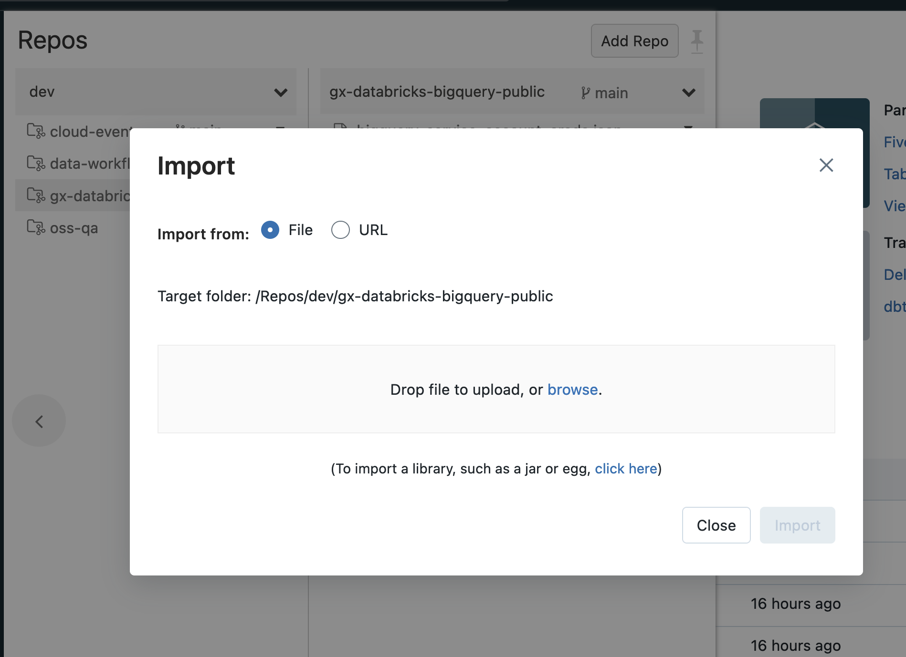

# Databricks Notebooks + Great Expectations: a Powerful Alliance for Validated Data Workflows
#### How to leverage the power of Databricks notebooks and GX data quality checks to create validated data workflows

If you've found your way to this blog, you've probably heard of (if not used extensively!) the [Databricks](https://databricks.com) platform. Here at [Great Expectations](https://greatexpectations.io/) we are heavy users of Databricks for our internal analytics because of its [robust support for Python](https://docs.databricks.com/languages/python.html), ability to switch between Python/Java/Scala/SQL interpreters, ease of [Spark configuration](https://www.databricks.com/spark/getting-started-with-apache-spark/quick-start#overview), and countless other features.

In this blog post I'll provide a framework for building a data workflow that:

- Creates a repository under source control
- Uses a [Databricks Notebook](https://docs.databricks.com/notebooks/index.html) replete with parameterization to accommodate variable date ranges and data sources
- Imports custom Python modules to facilitate better extensibility of workflow tasks
- Retrieves public data from [BigQuery Public Datasets](https://cloud.google.com/bigquery/public-data)
- Uses the [GX open-source library](https://greatexpectations.io/gx-oss) to add essential data quality checks


## Step 0: Setup

### General requirements

As this is a fairly detailed integration of multiple tools, some working knowledge of Python, SQL, Git, and Databricks is assumed. Prior experience with GX could prove useful, but is not strictly required.

- A Databricks account and a Workspace setup on a supported cloud provider (AWS, Azure, GCP).

- A compute cluster running [Databricks Runtime](https://docs.databricks.com/release-notes/runtime/releases.html) 12.0 or higher.

- A Git account with a [Git provider supported by Databricks](https://docs.databricks.com/repos/index.html).

- [Databricks for Git Repos](https://docs.databricks.com/repos/repos-setup.html) configured.

- A [Google Cloud Platform (GCP) project](https://cloud.google.com) account and ability to create a project and generate a service account with API credentials.


### Databricks repos
If you haven't already configured Databricks for Git Repos integration, follow the Databricks instructions [here](https://docs.databricks.com/repos/repos-setup.html).



The default behavior when adding a repo to Databricks is to add it to your user folder (yourname@yourdomain.com). Instead of doing this, we're going to create a new directory in `/Repos` called "dev" and add the repo there. You can always clone the repo elsewhere later on, but this will be our starting place for getting our workflow configured.

### Google BigQuery public data access
We'll use the [pandas-gbq](https://pandas-gbq.readthedocs.io/en/latest/index.html) library to access [BigQuery Public Datasets](https://cloud.google.com/bigquery/public-data).

There are multiple ways to authenticate, but for this exercise we'll be authenticating using credentials from a GCP service account. We'll be generally following the steps outlined in "Authenticating with a Service Account" in the `pandas-gbq` [docs](https://pandas-gbq.readthedocs.io/en/latest/howto/authentication.html).



From the GCP Console:

1. Access the [service accounts page](https://console.cloud.google.com/projectselector2/iam-admin/serviceaccounts). 
2. Create a new project and a service account for the project. 
3. Add a private key to the service account and download the JSON file to your local machine.
4. Upload the private key JSON file to your repo.
 
Ultimately, you can manage your secret credentials however you like. In order to get started, however, let's go ahead and add the file to the top-level directory of the repo as `.bigquery_service_account_creds.json`.

There are a couple of options adding the service account credentials JSON file to the repo: 

__Option 1: Use the Databricks Repos UI to import__
1. Navigate to the repo top-level directory from the Repos menu in the left sidebar 
2. Click on the down arrow icon to the right of the repo
3. Select "import" from the dropdown menu
4. Upload your file

__Option 2: Push to the repo from your local machine__
1. Clone the repo to your local machine
2. Add the creds JSON file to the top level of the repo
3. Commit the file and push to remote
4. Pull in Repo changes from the Databricks UI

As always, be sure to not check your credentials files into git (e.g. by using a `.gitignore` file)!




### Repo organization
Let's briefly touch on the organization of this repo's contents:

#### `/` (top level)
- Directories 
- dotfiles (e.g. `.gitignore`)
-  GCP Service Account credentials JSON file
-  repo config YAML file
-  Pandas DataFrame PKL file with some sample data

#### `/src`
- Databricks notebooks with executable code for scheduled orchestration

#### `/utils`
- Python files (_not_ databricks notebooks!) to be imported

#### `/great_expectations` 
- Anything pertaining to data validation with GX

The general idea is to use Databricks notebooks in `/src` as the workhorses for automated data workflows. In these notebooks, we get data, transform it, validate its quality, and write it to storage. To help us with these typical data tasks, we import modules from `/utils`. 

### Repo configuration with `config.yml`
Making use of a simple configuration file can be a good way to avoid messy find/replace operations: if you need to change the name or value of a variable, you can do it in one place instead of many.

The default contents of the file are shown below:

```YAML
# assumed directory structure is: /Workspace/repos/{repo_directory}/{repo_name}

# {repo_directory} in assumed directory structure
repo_directory: "dev"

# {repo_name} in assumed directory structure
repo_name: "gx-databricks-bigquery-public"

# relative path of BigQuery service account credentials file
bigquery_creds_file: ".bigquery_service_account_creds.json"

# relative path of great expectations directory
gx_dir: "great_expectations"

# provide a name to help identify the GX data connector type
gx_connector_name: "pandas_fluent"

```

Be sure to modify the config file to accomodate your preferences! The default name for our GCP service account credentials file, for example, is ".bigquery_service_account_creds.json"; but nothing precludes you from naming it something else. Just be sure to keep filenames concurrent with your `config.yml` file!

To avoid instances of `FileNotFoundError` and other problems:
- Do not rename or move the `config.yml` file out of the top-level directory.
- Use one `name: 'value'` pair per line.
- Maintain a directory structure of `/Workspace/Repos/{repo_directory}/{repo_name}`. If you deviate from this pattern, the helper functions in the repo may not be able to locate files correctly.

### GX notes

This framework uses GX version `0.16.6`. Due to its use of [fluent Datasource configuration](https://greatexpectations.io/blog/), it will not work with any version of GX prior to `0.16`. If you encounter any questions while adapting this framework for use with a GX version other than `0.16.6`, check out the #gx-community-support channel of [our community Slack](https://greatexpectations.io/slack).

This example also uses my own GX wrapper library, which abstracts a significant amount of GX configuration for the sake of simplicity. Keep this in mind if you're looking at this alongside the [official GX documentation](https://docs.greatexpectations.io/docs), which doesn't use these wrappers.

## Step 1: Initializing repo notebooks with Python dataclasses

Our workhorse notebook is in the `src` directory called `pypi_pkg_downloads`. 

Open the notebook and connect it to an active cluster. The libraries `pandas-gbq` and `great-expectations` are required, so install them as [notebook-scoped libraries](https://docs.databricks.com/libraries/notebooks-python-libraries.html) with `%pip install` by running the first cell. (Alternately, you can install them [on your cluster](https://docs.databricks.com/libraries/cluster-libraries.html)). 

Run the subsequent cells to clear notebook parameters, import modules and create our dataclasses.

### Initializing a Notebook

We have a dataclass called `Notebook` that holds some metadata from our Databricks notebook.

```Python
# create a notebook dataclass
nb = Notebook()

# show attributes
nb.attributes
```

The notebook attributes are:
- path: Absolute path of the notebook
- url: URL of the notebook at `https://your-workspace-name.cloud.databricks.com`
- has_git: `True` if the Notebook is associated with a Git repo (i.e. in `/Workspace/Repos`)
- name: The filename of the current notebook
- repo: URL of cloned git repo
- branch: Current Git branch name
- config_file: Relative path of `config.yml` file

We also have a dataclass called `RepoConfig` that holds, well... _even more stuff_. 

Notably, it has: 
- The variables from `config.yml`
- Databricks notebook parameters (aka widgets -- docs [here](https://docs.databricks.com/notebooks/widgets.html)) populated with some deafult values
- A `pandas_gbq` context for GCP authentication
- Default settings for configuration of GX

In essence, by getting a `RepoConfig` in the top of the notebook, we immediately give ourselves access to BigQuery public datasets and the ability to create some pre-configured GX object names.


```Python
# initialize notebook with repo_config
rc = repo_utils.get_repo_config(config_file=nb.config_file)

# show attributes
rc.attributes
```

For the sake of brevity, we won't go into extensive details on what all is contained in the `RepoConfig` dataclass, but it's worth inspecting the attributes and seeing what's in there for yourself.

## Step 2: Connecting to BigQuery public datasets and getting data

Now that our notebook has been configured, we can move on to getting our hands on some data. Well, almost.

Before querying the data from your Databricks notebook, I recommend that you [add the public dataset to your project via the Google Cloud Console](https://console.cloud.google.com/bigquery\(analyticshub:projects/1057666841514/locations/us/dataExchanges/google_cloud_public_datasets_17e74966199/listings/python_package_index_pypi_17f0bae64b5) and use the Console to inspect the table schema and potential resource consumption. 

To limit resource consumption, restrict the number of partitions you query by querying along the `timestamp` field, and also be sure to always use `where file.project = ...` so you're only looking at downloads for packages of interest. 

Ok now we're _really_ ready to get some data. Since we already have a `pandas-gbq.context` object in our `RepoConfig` dataclass, we're ready to start querying. 

The `pandas-gbq` library gives us the ability to return query results as a Pandas DataFrame. There are many datasets avaialble, but in this demonstration we're going to only look at downloads of the `great-expectations` library from the Python Package Index (PyPI). (See [Analyzing PyPI Package Downloads](https://packaging.python.org/en/latest/guides/analyzing-pypi-package-downloads/) for more information on analyzing PyPI downloads.)

Our parameterized query (using BigQuery syntax!) will return data based on our notebook parameters for dates and the PyPI package of interest:

```Python
# BigQuery syntax!
query = f"""
select
  timestamp as download_time,
  country_code,
  file.type as file_type,
  file.version as pkg_version,
  coalesce(details.python, details.implementation.version) as python_version,
  details.installer.name as installer_name,
  details.installer.version as installer_version,
  details.distro.name as distro_name,
  details.distro.version as distro_version,
  details.system.name as system_name,
  details.system.release as system_version,
  date(timestamp) as dt
from
  `bigquery-public-data.pypi.file_downloads`
where
  file.project = "{dbutils.widgets.get('param_pypi_pkg')}"
  and date(timestamp) between "{dbutils.widgets.get('param_dt_begin')}"
  and "{dbutils.widgets.get('param_dt_end')}"
"""

# get a pandas dataframe of query results
df = read_gbq(query, use_bqstorage_api=True)

# inspect pandas dataframe schema
df.info()
```

Inspect the Pandas DataFrame as needed, but be aware that in the next section we'll be checking the quality of the data with GX.

## Step 3: Data quality with the GX library

We've inspected our batch of PyPI downloads data and it looks good...at least at the moment. But what if our next batch—or any other batch, for that matter—is not? How will we know there's a problem until we query the data from disk and just so happen upon one? 

Enter GX.

Let's assume that we're interested in tracking daily downloads of the `great-expectations` Python library from PyPI over time and need to build an automated data workflow to get and store the data so our team of analysts can keep on eye on download trends. Every day we'll query data, do some quality checks, and write the data to disk if there are no major data quality issues. If we do find severe quality issues with the data, however, we'll fail the workflow and investigate the issues instead of writing bad data to the warehouse.

### Creating GX Objects for data validation

A GX [Expectation](https://docs.greatexpectations.io/docs/terms/expectation) is a verifable assertion about data. For example, we may _expect_ that a column with user IDs doesn't have any null values, or that a column with timestamps has values within a certain range. Based on our knowledge of the data, we can create a GX [Validator](https://docs.greatexpectations.io/docs/terms/validator), which will hold our Expectations, and can be used to check the integrity of the data values in our Pandas DataFrame.

The following cell will create a GX [Data Context](https://docs.greatexpectations.io/docs/terms/data_context) with our default configuration for an in-memory Pandas DataFrame: 

Run the following snippet in the notebook to instantiate a Validator. 

```Python
# get a gx validator
validator = gx_utils.default_validator(pandas_df = df, date_range=date_range)
```

For every `validator.expect_*` statement within the method, a progress bar will be generated in the notebook cell. The size of our Pandas DataFrame is relatively small, so this should only take a few seconds, but consider that the time will vary depending on cluster size, data size, number of Expecations in the Validator, etc.

The Expectations created by the `gx_utils.default_validator()` method are not meant to be exhaustive. Rather, they're intended to provide a working example of different types of Expectations and how they can be applied in bulk (i.e. to multiple columns using a list comprehension).

Below is a partial descriptive list:
- `download_time`, `country_code`, `file_type`, `pkg_version` and `dt` should _never_ be null
- All other columns should _mostly_ (>= 95%) not be null
- `download_time` should be of type "Timestamp"
- `download_time` should be within the specified date range
- `country_code` should _mostly_ (>=99%) be in our list of ISO country codes in `utils/iso3166.py`
- `pkg_version` should _mostly_ (>=95%) match our prescribed regex pattern

You can find a full list of available Expectations [here](https://greatexpectations.io/expectations/). 

### Validating data against the Expectation Suite

The next step is to create a GX [Checkpoint](https://docs.greatexpectations.io/docs/terms/data_context) that encompasses our Pandas DataFrame, our Validator and our Evaluation Parameters. 

```Python
# create a checkpoint for validating pandas dataframe against expectation suite
checkpoint = gx_utils.default_checkpoint(
    pandas_df=df,
    validator=validator,
    evaluation_parameters={
        ep: validator.get_evaluation_parameter(ep) for ep in ["min_ts", "max_ts"]
    },
)
```

The Checkpoint by itself doesn't do anything; we actually need to _run_ the Checkpoint to see the data validation results.

```Python
# run the checkpoint against the validator
checkpoint_run = checkpoint.run()
```

The `checkpoint_run` variable, which is an instance of the `CheckpointResult` class, contains the default contents from a Checkpoint execution. Since we're already deep into Dataclasses and Other Python Conveniences territory, let's go even futher and use our class extension of the `CheckpointResult` class!

```Python
# create a results object
results = gx_utils.CheckpointRunResult(checkpoint_results)
```

Now we have some additional quality-of-life methods available to us. For example, let's call the `check_results()` method to fail the workflow if we encountered too many errors and the `list_failures()` method to show us details about what failed: 

```Python
# raise an error if expectations failed > expectations failures allowed
results.check_results(failures_allowed=0)

# list failures from validation results
results.list_failures()

```

This sort of thing could be useful if, for example, you wanted to terminate a scheduled run prior to persisting data to your data lake or data warehouse because it exceeded your data quality comfort threshold.

## Summary

I hope you've found this framework useful as a "real world" example of how you can leverage GX to build a workflow. In this example we worked with PyPI downloads of the GX library, but there are many other interesting public datasets available in BigQuery that are now available to you.

If you have any questions about using GX, either about this framework specifically or in your own implementation, check out #gx-community-support in the [GX community Slack](https://greatexpectations.io/slack). And, if you'd like to see more examples like this framework, let us know in #gx-feedback.

## Links
- [Analyzing PyPI package downloads](https://packaging.python.org/en/latest/guides/analyzing-pypi-package-downloads/)
- [BigQuery API authentication](https://cloud.google.com/bigquery/docs/authentication/)
- [pandas-gbq](https://pandas-gbq.readthedocs.io/en/latest/index.html)
- [BigQuery syntax](https://cloud.google.com/bigquery/docs/reference/standard-sql/query-syntax)
- [BigQuery public datasets](https://cloud.google.com/bigquery/public-data)
- [Git integration with Databricks repos](https://docs.databricks.com/repos/index.html)
